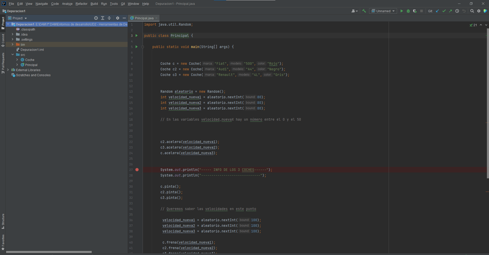
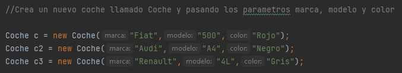
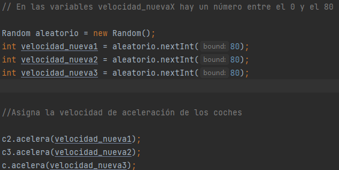
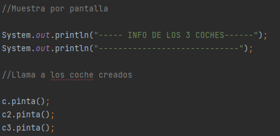
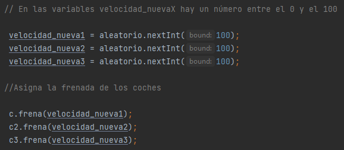
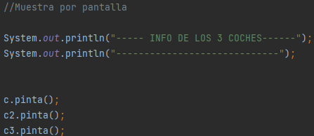
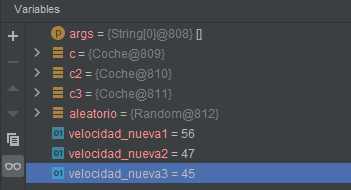
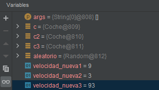

## Donat el codi a JAVA de la classe cotxe que compta amb els mètodes:
- Constructor on se li estableix la marca, model, color i la velocitat inicial del qual és 0.
- Getters i setters de cada paràmetre. 
- Mètode accelera (int vel) que incrementa la velocitat del cotxe en “vel” Km/h.
- Mètode frena(int vel) que decrementa la velocitat del cotxe en “vel” Km/h.
- para() que posa la velocitat a 0.
- pinta() que pinta el cotxe més a prop o més lluny segons la velocitat que tinga en aqueix
moment.

#### A més , la classe Principal té el mètode:

<dir>pubic static void main(String [] args) punt d'inici del programa → punt d'inici del programa</dir>

#### 0. Importar el projecte en INTELLIJ.

#### 1. Explicad QUÈ FA EL MÈTODE MAIN.
Crea 3 coches utilizando la class Coche, pasando la aceleración y el franado del coche y luego muestra por pantalla

#### 2. Posad un punt de ruptura (breakpoint) en la línia 27 del mètode main de la classe Principal i esbrineu els valors de les variables velocitat_nueva1, velocitat_nueva2 i velocitat_nueva3. Esbrineu també quines dades tenen en els seus paràmetres els cotxes amb variables c,c2 i c3.

<dir>
    <b>c</b> →  Tiene una aceleración de 45 
    <b>c2</b> → Tiene una aceleración de 56 
    <b>c3</b> → Tiene una aceleración de 47
</dir>

#### 3. Posad un punt de ruptura (breakpoint) en la línia 46 del mètode main de la classe Principal i esbrineu els valors de les variables velocitat_nueva1, velocitat_nueva2 i velocitat_nueva3. Esbrineu també quines dades tenen en els seus paràmetres els cotxes amb variables c,c2 i c3.

<dir>
    <b>c</b> →  Tiene una aceleración de 45 y un frenado de 9 
    <b>c2</b> → Tiene una aceleración de 56 y un frenado de 3 
    <b>c3</b> → Tiene una aceleración de 47 y un frenado de 93
</dir> 

**Nota:** Realitzeu les captures de pantalla que cregueu convenient per a adjuntar en el document.
(per exemple com pinta els cotxes el programa abans de frenar i després de frenar)

**Contesteu les qüestions en un fitxer markdown i pugeu-lo al vostre repositori GITHUB. Dins d'una carpeta anomenada** Depuración2 **Compartiu la URL del repositori**

**Nota:** El mètode nextInt(valor) de la clase Random obtí un número aleatori entre 0 i val