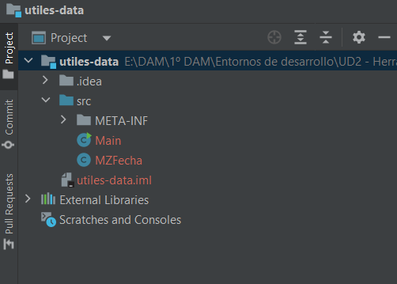
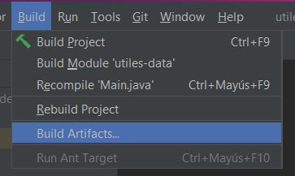
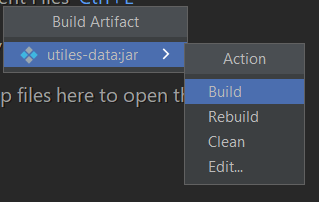
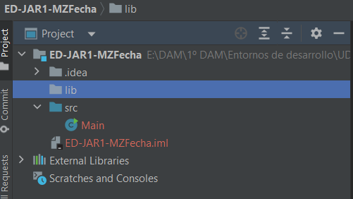
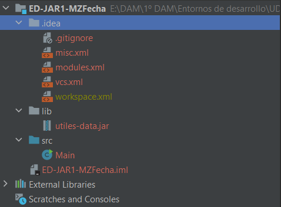
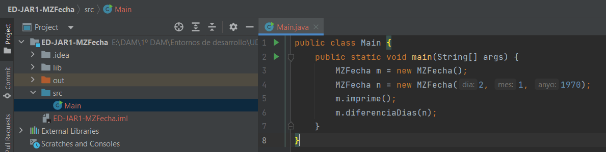

# TASCA 3. - FITXERS JAR 1 
Els fitxers JAR permeten tindre empaquetades classes d'utilitat que podem usar en els nostres
projectes futurs. Aquesta pràctica tracta d'usar la classe MZFecha empaquetada en un .jar des
d'un altre projecte que no tinga el codi de la classe MZFecha.

Donada la classe proporcionada MZFecha ( en el seu arxiu .java corresponent).

## Part A: Crear un Fitxer JAR
1. Crea un projecte INTELLIJ anomenat utiles-data en el qual estiga el fitxer MZFecha.java dins del directori src.

2. Exporta aquest fitxer a un fitxer JAR denominat utiles-data.jar (Mira com es fa en el PDF
d’apunts)

## PART B: USAR EL FITXER .JAR EN UN ALTRE PROJECTE

3. Crea un nou projecte INTELLIJ denominat ED-JAR1-MZFecha
- Crea una carpeta denominada lib dins d'aquest projecte

- Còpia el fitxer utiles-data.jar creat anteriorment dins del directori lib

- Afig el JAR al nou projecte com s'indica en els apunts

A partir d'ací crea una classe Principal amb un mètode main que utilitze la classe MZFecha, en la
qual:

**Aquest programa mostrarà un menú per a poder provar les opcions de la classe MZFecha:**
- **establir data** → Demana el día, mes i any
- **imprimir Data** → Imprimeix la data establida
- **Diferència entre dues dates** → Demana una altra data (d,m,a) i calcula la diferència entre les 2 dates.

