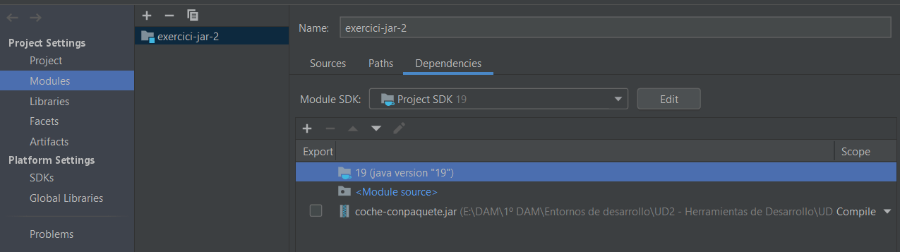
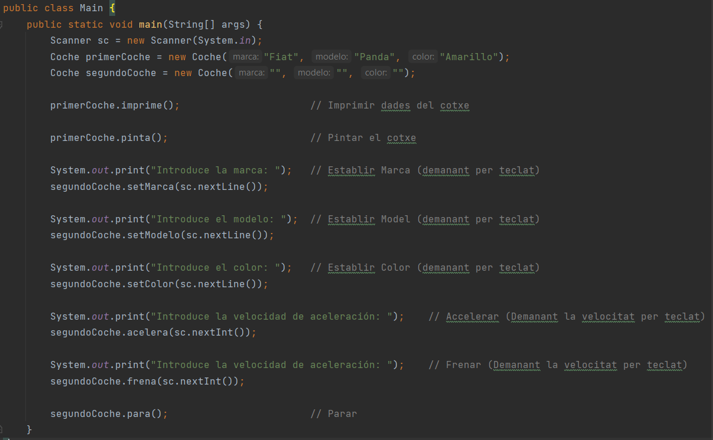

# TASCA 4. 

Donat el fitxer cotxe.jar que inclou la classe Cotxe amb tots els mètodes especificats en la
documentació que es troba en format HTML en el fitxer comprimit doc-cotxe.zip:

• Crea un projecte denominat exercici-jar-2 en el qual inclogues en fitxer cotxe.jar en un
directori lib

• Afig aquest fitxer .jar en el mòdul del projecte (com indica les anotacions)

A partir d'ací crea una classe Principal amb un mètode main que utilitze la classe Cotxe, en la
qual:

Crear un cotxe Marca “Fiat” Model “Panda” Color “Groc”
Mostre un menú per a poder provar les opcions de la classe Cotxe:

- **Imprimir dades del cotxe**
- **Pintar el cotxe**
- **Establir Marca (demanant per teclat)**
- **Establir Model (demanant per teclat)**
- **Establir Color (demanant per teclat)**
- **Accelerar (Demanant la velocitat per teclat)**
- **Frenar (Demanant la velocitat per teclat)**
- **Parar**
